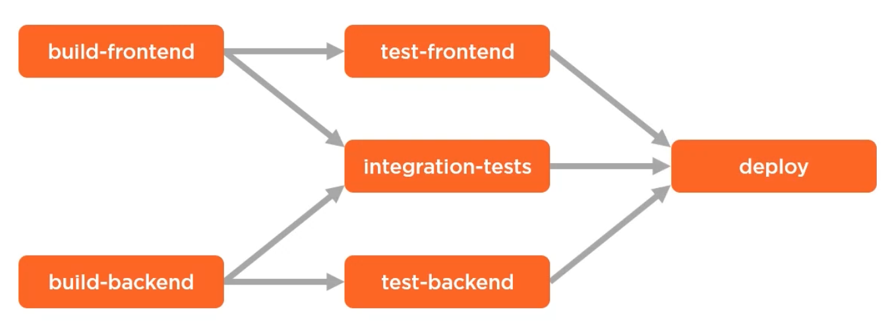
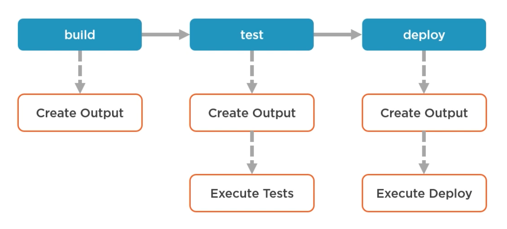
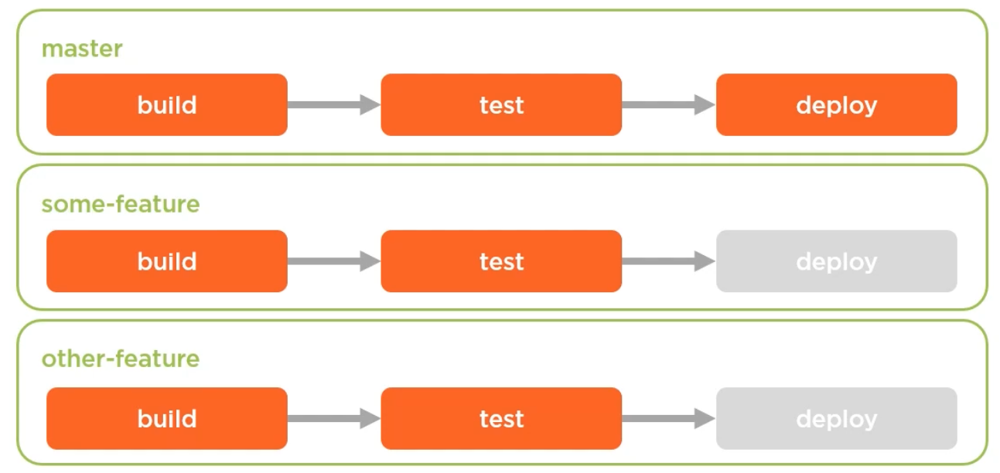

# CircleCI Best Practices

## General

### Parallel Execution

The simplest relationship in a workflow is one of simply executing jobs serially, one after the other.

Run as many jobs simultaneously as possible. Few example scenarios:

- If we have 3 kinds of tests, we can run them async, so we don't have to execute them one by one and wait 12 minutes (we
have to wait until the longest job will finish).
- When installing some dependencies if they do not rely each other.



```yml
# Setup jobs
version: 2
jobs:
  build-frontend:
    docker:
      - image: circleci/node:7.10
    working_directory: ~/repo
    steps:
      - run: echo build-frontend step

  build-backend:
    docker:
      - image: circleci/node:7.10
    working_directory: ~/repo
    steps:
      - run: echo build-frontend step

  build-frontend:
    docker:
      - image: circleci/node:7.10
    working_directory: ~/repo
    steps:
      - run: echo build-backend step

  test-backend:
    docker:
      - image: circleci/node:7.10
    working_directory: ~/repo
    steps:
      - run: echo test-frontend step

  test-frontend:
    docker:
      - image: circleci/node:7.10
    working_directory: ~/repo
    steps:
      - run: echo test-backend step

  integration-tests:
    docker:
      - image: circleci/node:7.10
    working_directory: ~/repo
    steps:
      - run: echo integration-steps step

  deploy:
    docker:
      - image: circleci/node:7.10
    working_directory: ~/repo
    steps:
      - run: echo deploy step

# Configure relationships in the workflow
workflows:
  version: 2
  build-and-test:
    jobs:
      - build-frontend
      - build-backend
      - test-frontend
          requires:
            - build-frontend
      - test-backend
          requires:
            - build-backend
      - integration tests:
          requires:
            - build-backend
            - build-frontend
      - deploy:
          requires:
            - test-frontend
            - test-backend
            - integration-tests       
```

### Sharing Files Between Jobs With Workspaces (Caching)

It's common to need build artifacts from earlier jobs in later jobs.

For instance, the build step is likely to produce some sort of compiled output. It would be wasteful to repeat the steps in the build job
in the test job so that we can have the build output to run the test against. Then, in the deploy job would also be wasteful to rerun the
build steps yet again so that we'd have the build outputs available to deploy to a server.



CircleCI provides something called a workspace for each workflow run, so that a job can store files in the workspace for later jobs to use.

```yml
version: 2
jobs:

  build:
    docker:
      - image: circleci/node:7.10
    working_directory: ~/repo
    steps:
      - run: echo build step
      - run: mkdir build_output
      - run: touch build_output/compiled_output.txt
      - persist_to_workspace:
          root: build_output
          paths: 
            - '*'                                        # Persist all files in the directory into the workspace
      
  test:
    docker:
      - image: circleci/node:7.10
    working_directory: ~/repo
    steps:
      - run: echo test step
      - attach_workspace: 
          at: ~/repo/workspace
      - run: ls ~/repo/workspace/compiled_output/.txt    # If the file isn't present, the ls command would return a non-zero exit code

  deploy:
    docker:
      - image: circleci/node:7.10
    working_directory: ~/repo
    steps:
      - run: echo test step
      - attach_workspace: 
          at: ~/repo/workspace
      - run: ls ~/repo/workspace/compiled_output/.txt    # If the file isn't present, the ls command would return a non-zero exit code
```

Depending of the kind of cached artifacts, this practice can speed up job execution.

### Enable/Disable Jobs per Branch

Typically we wouldn't want to deploy the code from anywhere but the master branch, that is, we only want to deploy code that
has passed the pull request process. On other-branches, we don't want that deploy job to run.



CircleCI supports controlling which jobs in a workflow run based on which branch they're on.

```yml
workflows:
  version: 2
  build-and-test:
    jobs:
      - build
      - test:
          requires:
            - build
      - deploy:
          requires:
            - test
          filters:
            branches:
              only:
                - master
      - test:
          requires:
            - test
          filters:
            branches:
              only:
                - master
      - test-environment:
          requires:
            - test
          filters:
            branches:
              ignore:
                - master
```

This is also applicable to tags.

### Scheduled Workflows

Sometimes it can be useful to being a workflow on a schedule. This can be useful for a number of reasons:

- More predictable than pushes
- Capacity management (if you find that branches have a high frequency of new commits being pushed and
are having issues with long queue times)
- Schedule for off-peak hours (like database maintenance or load testing)

The following sample says "run this job at 2:15 am every day".

```yml
perf-tests:
  jobs:
    - perf-testing
  triggers:
    - scheduled:

        filters:
          branches:
            only:
              - master
```

### Manual Approvals

The purpise is to pause a workflow until a human approves it and allows it to continue. A manual approval can be useful
to help control the timing of workflow execution in the face of dynamic events that are hard to automate around.

Instances: A deployment introduces a few seconds of downtime, it might be wise to hold that deployment if, say, there's an
important demo going on right now.

```yml
workflows:
  version: 2
  build-and-test:
    jobs:
      - build
      - test
          requires:
            - build
      - hold:
          type: approval
          requires:
            - test
      - deploy:
          requires:
            - hold
          filters:
            branches:
              only:
                - master
```

### Status Checks and Badges

GitHub provides a facility for third-party integrators like CircleCI to specify the status of a commit. GitHub calls this a status check.


It's common to see status badges onto:

- public repositories - so that it's easy to see whether the build for the latest commit is passing or failing
- in a project's readme file.


## Security

### Secrets Management

You do not want to check your secrets into version control, and secrets should never be written in plain text in your config. For example:

```terraform
# Configure the Microsoft Azure Provider
provider "azurerm" {
  features {}

  subscription_id = "00000000-0000-0000-0000-000000000000"
  client_id       = "00000000-0000-0000-0000-000000000000"
  client_secret   = var.client_secret
  tenant_id       = "00000000-0000-0000-0000-000000000000"
}
```

It is recommended to store the secrets as environmental variables into the CircleCI dashboard. These secrets are only redable from within jobs.


Keep in mind that anyone with access to create and push commits to the repository, even pull requests can potentially have
access to the secrets that you've entered into the CircleCI dashboard. Therefore, commiteres are granted trust to be able to
manage those secrets appropiately. This also means that appropiate steps must be taken in the build deninitions to ensure that secrets
aren't accidentaly leaked into the build logs, specially for public repositories where the CircleCI build logs are also public.

### Multiple-context Per Workflow

To further restrict access, having multiple-contexts per workflow allows developers to restrict access to environment variables by
letting them include values in a particular domain, rather than a given workflow. This provides greater granularity when requiring
access to a specific context in a workflow, improving your organization’s security.

### Define Environment Variables Per Stage Using CircleCI Contexts

Most environment will have at least two stages (dev and prod) and we do not want to add prefix in each environment variable. As an example:

```bash
DEV_ARM_SUBSCRIPTION_ID =  "00000000-0000-0000-0000-000000000000"
PROD_ARM_SUBSCRIPTION_ID = "11111111-1111-1111-1111-111111111111"
```

CircleCI provides you with access to [contexts](https://circleci.com/docs/contexts) where environment variables can be defined per stage.

These allow you to secure and share environment variables across projects in your organization. Contexts are essentially a secret store where you can
set environment variables as name/value pairs that are injected at runtime.
